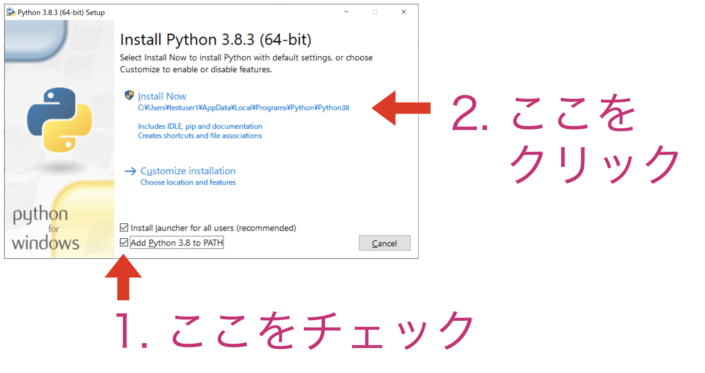
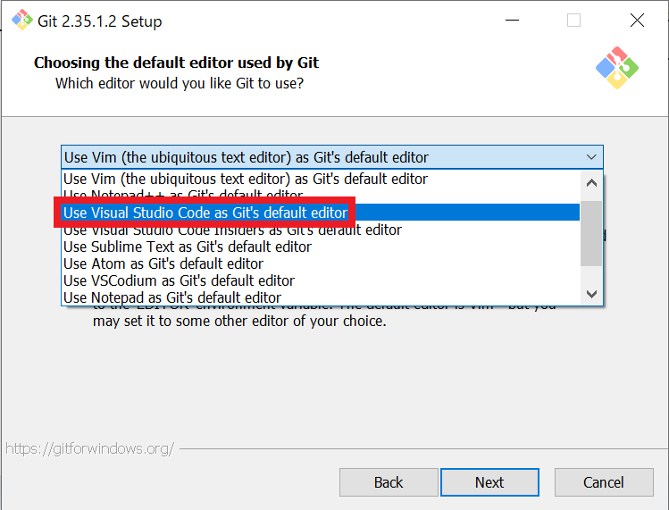
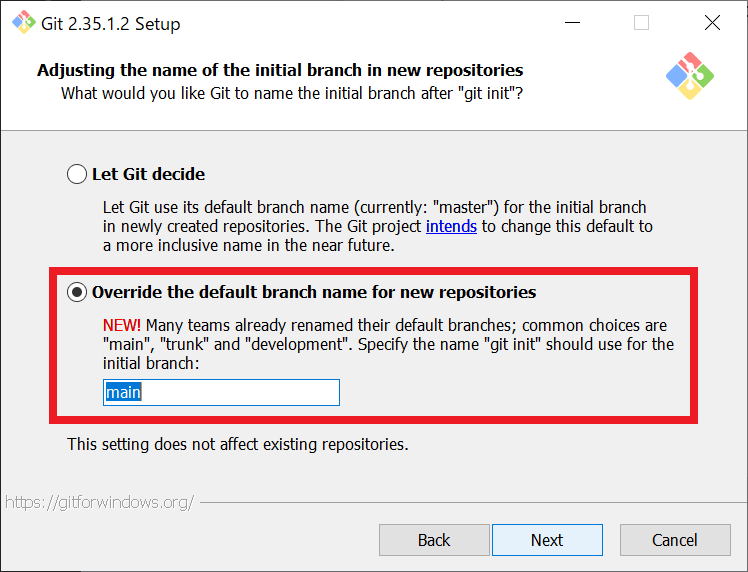

# 研究室新入生向け開発環境構築ガイド

このガイドでは、研究室で必要な基本的なツールのインストールと設定方法を説明します。

## 目次
- [研究室新入生向け開発環境構築ガイド](#研究室新入生向け開発環境構築ガイド)
  - [目次](#目次)
  - [Visual Studio Code のインストール](#visual-studio-code-のインストール)
    - [推奨拡張機能のインストール](#推奨拡張機能のインストール)
  - [Python のインストール](#python-のインストール)
    - [インストールの確認](#インストールの確認)
  - [Git のインストール](#git-のインストール)
    - [インストールの確認](#インストールの確認-1)
  - [GitHub アカウントの設定](#github-アカウントの設定)
    - [Git の初期設定](#git-の初期設定)
  - [SSH キーの生成と GitHub への登録](#ssh-キーの生成と-github-への登録)
    - [SSHキーの生成](#sshキーの生成)
    - [GitHubへの公開鍵の登録](#githubへの公開鍵の登録)
    - [接続テスト](#接続テスト)
  - [トラブルシューティング](#トラブルシューティング)
    - [よくある問題と解決方法](#よくある問題と解決方法)
    - [参考](#参考)

## Visual Studio Code のインストール


Visual Studio Code（VSCode）は、プログラミングに適した高機能なテキストエディタです。

1. [Visual Studio Code のダウンロードページ](https://code.visualstudio.com/)にアクセス
2. 「Download for Windows」ボタンをクリック
3. ダウンロードされたインストーラーを実行
4. 以下の項目にチェックを入れることを推奨：
   - 「Code で開く」アクションをエクスプローラーのファイルのコンテキストメニューに追加
   - 「Code で開く」アクションをエクスプローラーのディレクトリのコンテキストメニューに追加
   - PATHへの追加

### 推奨拡張機能のインストール

VSCode起動後、以下の拡張機能をインストールすることを推奨します：

1. Python（Microsoft）
2. Pylance
3. Git Graph
4. Japanese Language Pack for VS Code（日本語表示が必要な場合）

## Python のインストール

Pythonは記述しやすく科学計算に適した機能が充実したプログラミング言語です


1. [Python公式サイト](https://www.python.org/downloads/)にアクセス
2. 「Download Python 3.x.x」ボタンをクリック（最新のLTS、安定版がおすすめ）
3. ダウンロードされたインストーラーを実行
4. インストール時の重要なオプション：
   - **「Add Python 3.x to PATH」にチェックを入れる**
  (簡単にPythonを呼び出して実行することができるようになります。大事です。)
   - 「Install Now」をクリック
    
5. PCを再起動する。(先ほど通したPATHをPCが読み込んでくれます。)

### インストールの確認

1. WindowsキーとRキーを同時に押し、「cmd」と入力してコマンドプロンプトを開く
2. 以下のコマンドを実行：
```
python --version
```
バージョン番号が表示されればインストール成功です。

## Git のインストール

GitはGithubと連携するために入れます。
上手に使うとデータのバックアップ、バージョンの管理を行えます。


1. [Git公式サイト](https://git-scm.com/downloads)にアクセス
2. 「Windows」をクリックしてインストーラーをダウンロード
3. インストーラーを実行し、以下の設定を推奨：
   - **Default Editor の設定はVisual Studio Codeにするのがおすすめ**
    
   - **default branch nameがmasterならばmainに変えてください**
    
   - **その他はデフォルト設定のまま**
4. PCを再起動

### インストールの確認

コマンドプロンプトで以下のコマンドを実行：
```
git --version
```
バージョン情報が出ればインストール成功です。

## GitHub アカウントの設定

GitHubでは世界中の人がいろいろなプログラムを公開しています。
先ほどインストールしたGitを使うことで、これらのプログラムをまとめてPCにダウロードできます。

1. [GitHub](https://github.com/)にアクセス
2. 「Sign up」をクリックして新規アカウントを作成
3. メールアドレス、ユーザー名、パスワードを設定
4. メール認証を完了

### Git の初期設定

コマンドプロンプトで以下のコマンドを実行（自分の情報に置き換えてください）：
```
git config --global user.name "あなたのGitHubユーザー名"
git config --global user.email "あなたのメールアドレス"
```

## SSH キーの生成と GitHub への登録

### SSHキーの生成

1. コマンドプロンプトで以下のコマンドを実行：
```
ssh-keygen -t ed25519 -C "あなたのメールアドレス"
```
2. 保存場所の指定を求められたら、Enterキーを押して既定の場所に保存
3. **パスフレーズの入力を求められたら、任意のパスフレーズを設定（何も入力せずEnterにするのがおすすめです。後で忘れてしまうので）**

### GitHubへの公開鍵の登録

1. 以下のコマンドで公開鍵の内容を表示：
```
type %USERPROFILE%\.ssh\id_ed25519.pub
```
2. 表示された内容をコピー
3. GitHubにログイン
4. 右上のプロフィールアイコン → Settings → SSH and GPG keys
5. 「New SSH key」をクリック
6. タイトルを入力（例：「Personal Laptop」）
7. 公開鍵をKey欄に貼り付け
8. 「Add SSH key」をクリック

### 接続テスト

コマンドプロンプトで以下のコマンドを実行：
```
ssh -T git@github.com
```
「Hi ユーザー名!」というメッセージが表示されれば成功です。

## トラブルシューティング

### よくある問題と解決方法

1. Python/Gitコマンドが認識されない
   - PCの再起動
   - PATHの確認

2. SSHキー生成時のエラー
   - Git Bashをインストールして実行

3. VSCodeで日本語が文字化けする
   - Japanese Language Packのインストール
   - エンコーディングの設定確認

### 参考
非常に参考になるサイトです。必要になったら参照するのがよいと思います。
- [計算科学のためのWindowsセットアップ](https://zenn.dev/ohno/books/356315a0e6437c)